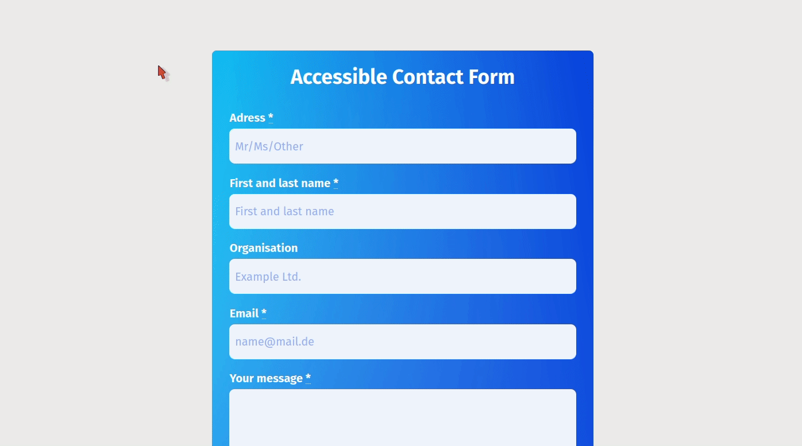

# Accessible Contact Form

Forms are one of the most critical parts for websites and apps regarding to user experience and conversion rate. This is a demo of how to create a frontend for a basic contact form in an accessible way.
As github does not allow for server-side code I included the original PHP-template and controller (which are based on Kirby CMS) just for reference. This example is about the UI part anyway.

## Features
- constraint validation API is extended by custom **regular expression patterns**
- layout is **responsive**
- markup uses **`abbr` tag** where neccessary
- critical typography (that is not placeholders) is clearly **readable** by size and contrast
- **highly visible custom focus styles** are used to give clear indications which do not rely on colour to keyboard users
- has **no columns** (e.g. label next to input or multiple inputs in one line)
- **uses labels** for the input information and therefore avoiding issues that can occur when you rely on placeholders:
  - lack of control over color: reduced readability
  - need for transitioning to a label, when placeholder disappears: small size,  possibly confusing movement and readability
  - ability to provide additional information on how exactly to fill out with placeholders
- labels are clearly associated with their respective fields by **proximity**
- **validation occurs on `blur` events** so it does neither distract while typing nor gives feedback when the user has already gone past that field
- validation hints are shown in close **proximity** to their fields
-  validation hints give **clear and detailed instruction** on what input is expected
- validation hints **do not rely on colour** alone
- empty and valid fields are distinguishable

